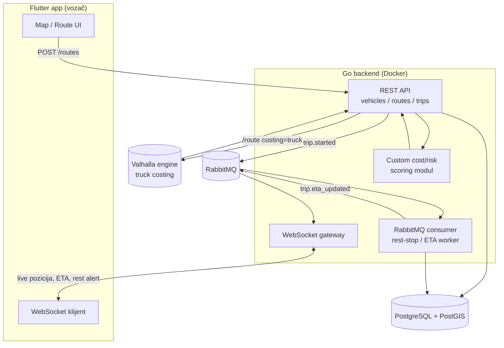

# Heavy Vehicle Routing — Specifikacija i plan rada

> Diplomski rad: mobilna aplikacija za rutiranje teretnih vozila na osnovu fizičkih karakteristika vozila i tereta, sa distribuiranim backend-om.
> Odabrani stack: **Go** (backend), **Flutter** (mobilna app), **Valhalla** (routing engine), **RabbitMQ** (async), **WebSocket** (real-time).
> Rok do odbrane: **~1 mesec**.

## 0. Trenutno stanje projekta (šta je već urađeno)

- `update-osm.sh` — automatizovan pipeline: preuzimanje Geofabrik ekstrakta za Srbiju → MD5 provera → `osmium tags-filter` → Valhalla graph build → restart servisa. Radi (potvrđeno u `osm-data/update.log`).
- `docker-compose.yml` — Valhalla servis + build profil. Kontejner trenutno **nije pokrenut** (`docker ps` prazan) — prva stvar za proveru.
- Valhalla graf za Srbiju je izgrađen (`valhalla/tiles/`, ~201MB).
- Nema još: backend koda, mobilne aplikacije, baze, RabbitMQ, WebSocket-a.
- README pominje GraphHopper i Flutter/React Native kao opcije — to je zastarelo u odnosu na stvarno stanje (Valhalla + Flutter su odabrani) i ažurirano je uz ovaj dokument.

## 1. Kritična napomena o roku

Mesec dana za ceo sistem (custom algoritam + Go backend + Postgres + RabbitMQ + WebSocket + Flutter app + modul radnih sati), krenuvši od nule na aplikativnom delu, je **veoma agresivno**. Plan u sekciji 6 je namerno sveden na **razor-thin MVP**: sve što nije neophodno za odbranu je označeno kao "future work" i ne sme da se dira dok MVP ne radi end-to-end. Ako bilo koja nedelja klizne, prva stvar koja se seče je modul radnih sati vozača (sekcija 3.8) — ne real-time praćenje niti algoritamski deo, jer su to nosivi delovi teme.

## 2. Arhitektura sistema


/graphApp.png

## 3. Komponente

### 3.1 OSM data pipeline (postojeće — treba doraditi)

Trenutni `osmium tags-filter` čuva samo `w/` (way) i `r/` (relation) tagove:
```
w/highway w/maxheight w/maxweight w/maxwidth w/hgv w/hazmat w/bridge w/tunnel w/surface w/maxspeed r/type=restriction
```
**Problem:** benzinske pumpe, parkinzi i odmarališta (`amenity=fuel`, `amenity=parking`, `highway=rest_area`) i tačkasti barijeri (`barrier=height_restrictor` na `node`) su u OSM-u skoro uvek **node**-ovi, a filter nema nijedno `n/` pravilo — ti podaci se trenutno odbacuju. Ovo je direktno potrebno za modul odmarališta (3.8), pa treba ispraviti pre nego što se na tome počne raditi:

```bash
osmium tags-filter serbia-latest.osm.pbf \
  w/highway w/maxheight w/maxweight w/maxwidth w/hgv w/hazmat w/bridge w/tunnel w/surface w/maxspeed \
  n/amenity=fuel,parking n/highway=rest_area n/barrier \
  r/type=restriction \
  --output serbia-hvt.osm.pbf --overwrite
```

### 3.2 Valhalla routing engine (postojeće)

Valhalla već ima ugrađen `truck` costing model koji prihvata **per-request** parametre — nije potrebno menjati Valhalla source kod da bi ruta zavisila od vozila:

```json
POST /route
{
  "locations": [{"lat":44.8,"lon":20.4},{"lat":45.25,"lon":19.85}],
  "costing": "truck",
  "costing_options": {
    "truck": {
      "height": 4.0, "width": 2.55, "length": 16.5,
      "weight": 40, "axle_load": 11.5,
      "hazmat": false
    }
  },
  "alternates": 2
}
```
Ovo je osnova za "fizička ograničenja vozila" iz teme i radi odmah, bez dodatnog razvoja.

### 3.3 Custom cost/risk scoring modul (Go) — glavni algoritamski doprinos

S obzirom na rok, **ne** pokušavati da se ceo Dijkstra/A* nad celom mrežom Srbije reimplementira od nule — Valhalla to već radi optimalno, a milioni čvorova u mesec dana nisu realni za sopstvenu implementaciju u produkciji. Umesto toga, dvoslojni pristup koji je i realan i akademski odbranjiv:

1. **Produkcioni sloj (koristi se u aplikaciji):** Valhalla vraća 2-3 alternative rute (`alternates`). Sopstveni Go modul dodaje **risk-scoring** koji Valhalla ne radi nativno — npr. broj mostova blizu graničnog opterećenja, blizina hazmat rute stambenim zonama, kombinovani rizik visina+težina na lošoj podlozi (`surface`) — i bira/preporučuje najbolju alternativu. Ovo je "dinamička cost funkcija" iz naslova teme, implementirana kao post-processing sloj.
2. **Algoritamska demonstracija (za poglavlje o algoritmu):** sopstvena A*/Dijkstra implementacija nad **ograničenim podgrafom** (npr. koridor Beograd–Novi Sad, par hiljada ivica, učitan direktno iz filtriranog OSM-a, bez Valhalla-e) sa sopstvenom cost funkcijom. Služi za merenje/poređenje i objašnjenje algoritma u radu — ne mora da pokriva celu državu niti da bude deo produkcionog puta.

Ovo daje jasnu naučnu priču ("prilagođena cost funkcija + evaluacija sopstvenog algoritma na ograničenom uzorku, produkcija oslonjena na Valhalla graf servis") bez potrebe da se gradi nacionalni routing engine od nule za mesec dana.

### 3.4 Backend API (Go)

REST servis: prima zahtev za rutu, mapira profil vozila u Valhalla `costing_options.truck`, poziva Valhallu, prosleđuje kroz scoring modul (3.3), čuva u bazi. Takođe upravlja vozilima i putovanjima (trips).

### 3.5 Baza podataka — PostgreSQL + PostGIS

PostGIS zbog geometrije ruta i geo-upita (npr. "najbliže odmaralište"). Šema u sekciji 4.

### 3.6 RabbitMQ — asinhrona obrada

Minimalan, ali stvaran async tok (dovoljan da opravda "distribuirana arhitektura" u radu):
- `trip.started` (publish iz API-ja kad vozač krene) → consumer (worker) računa predlog odmarališta duž rute i ETA → `trip.eta_updated` (publish) → WebSocket gateway konzumira i gura klijentu.

Ne graditi punu produkcionu topologiju (retry/DLQ/multi-exchange) — jedan topic exchange, dve routing key, dovoljno je za demo i za poglavlje o arhitekturi.

### 3.7 WebSocket gateway — real-time praćenje

Push kanal po aktivnom putovanju (`trip_id`). Za demo bez fizičkog vozila: simulacija GPS pozicije duž rutne geometrije u fiksnom intervalu — standardna i prihvatljiva praksa za diplomski demo, jer testiranje sa pravim kamionom nije realno u ovom roku.

### 3.8 Modul radnih sati i pauza vozača

Zbog roka: **ne** implementirati punu AETR/EU regulativu. Pojednostavljeno pravilo (npr. "nakon N minuta vožnje predloži najbliže odmaralište iz OSM `amenity=fuel/parking` podataka duž preostale rute") je dovoljno za demonstraciju koncepta; puna zakonska logika ide u "budući rad" u zaključku rada.

### 3.9 Mobilna aplikacija (Flutter)

Ekrani: (1) profil vozila (visina/težina/širina/dužina/hazmat — lokalno, bez auth-a za MVP), (2) mapa + zahtev za rutu (`flutter_map` + OSM tile-ovi ili sopstveni Valhalla vector tile), (3) aktivna vožnja — live pozicija preko WebSocket-a, ETA, alert za pauzu.

## 4. Model podataka (skica)

- **Vehicle**: id, height_m, width_m, length_m, weight_kg, axle_load_kg, hazmat (bool), hazmat_class
- **Driver**: id, name
- **Trip**: id, vehicle_id, origin, destination, route_geojson, status, started_at
- **RestStop**: id, trip_id, osm_node_id, lat, lon, type (fuel/parking)
- **LocationPing**: trip_id, lat, lon, ts *(ovde upisuje simulator pozicije)*

## 5. API skica

```
POST /api/v1/vehicles
POST /api/v1/routes      {origin, destination, vehicle_id} -> {geometry, distance, duration, risk_score, alternates[]}
POST /api/v1/trips       {route_id} -> {trip_id}
WS   /ws/trips/{trip_id} -> {lat, lon, ts, eta, next_rest_stop}
```
RabbitMQ: topic exchange `trip.events`, routing keys `trip.started`, `trip.eta_updated`.

## 6. Plan rada — 4 nedelje

| Nedelja | MORA (za odbranu) | NE raditi sada (future work) |
|---|---|---|
| **1** | Podići Valhalla stack, potvrditi truck costing preko `curl`; ispraviti osmium filter (3.1) i rebuild; Postgres+PostGIS u compose-u; Go skeleton + `POST /routes` koji zove Valhallu | Auth, multi-user, produkcioni RabbitMQ |
| **2** | Custom risk-scoring sloj (3.3.1) nad Valhalla alternativama; bounded A*/Dijkstra demo (3.3.2) sa unit testovima; RabbitMQ minimalni tok (`trip.started` → worker → `trip.eta_updated`) | Puna AETR logika, elevation/nagib rizik |
| **3** | Flutter: profil vozila → mapa → prikaz rute; WebSocket gateway + simulacija pozicije; alert za odmaralište | Offline mod, real GPS integracija |
| **4** | Integracija (jedan `docker compose up`), bugfix, pisanje poglavlja rada (sekcija 8), fiksne demo rute testirane unapred za odbranu, buffer | Evropa/multi-country, security hardening |

## 7. Rizici

- **OSM node tagovi** su trenutno filtrirani van (3.1) — ispraviti u nedelji 1, pre nego što se gradi modul odmarališta.
- **Nacionalni custom routing od nule** je van dometa za mesec dana — zato hibridni pristup (3.3): Valhalla u produkciji, sopstveni algoritam na ograničenom uzorku za evaluaciju.
- **Previše pokretnih delova odjednom** (Go + Postgres + RabbitMQ + WebSocket + Flutter) — držati `docker-compose` ažuran od nedelje 1 i integraciono testirati svake nedelje, ne ostavljati za kraj.
- **Live demo na odbrani zavisi od interneta/servisa** — pripremiti fiksne, unapred testirane demo rute i, ako je moguće, sve pokrenuti lokalno (Valhalla + Postgres + RabbitMQ su već kontejnerizovani).

## 8. Predložena struktura poglavlja rada

1. Uvod i motivacija
2. Pregled postojećih rešenja (Google/PTV/TomTom trucking, OSRM/GraphHopper/Valhalla poređenje)
3. Podaci — OSM ekstrakcija i ograničenja tagova za teretna vozila u Srbiji (3.1)
4. Arhitektura sistema (sekcija 2, dijagram)
5. Algoritam rutiranja prilagođen vozilu — Valhalla truck costing + sopstveni scoring/A* i evaluacija (3.3)
6. Distribuirana komunikacija i mobilna aplikacija (3.6–3.9)
7. Modul pauza vozača i njegova ograničenja (3.8)
8. Testiranje i evaluacija (poređenje sa/bez custom scoring-a)
9. Zaključak i budući rad (Evropa, offline mod, puna AETR regulativa, real GPS)
